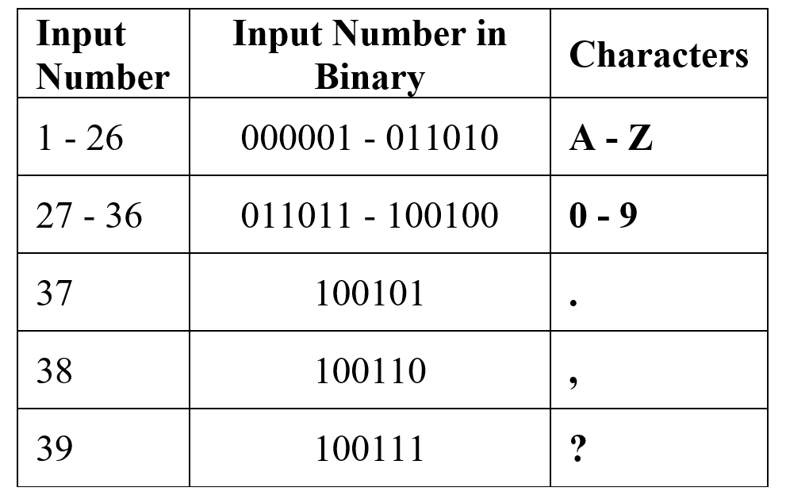
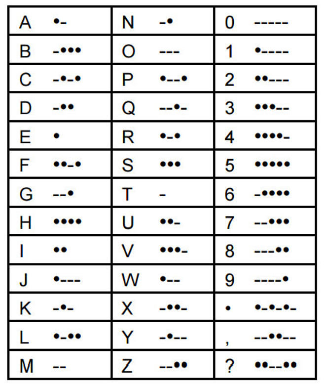
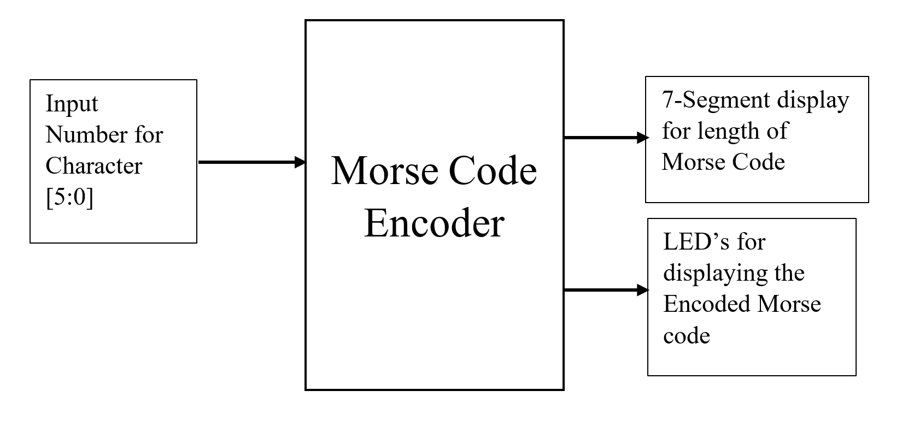

# Morse Code Encoder on Basys3

This is a project done for course - Design with CPLD and FPGA 
### Abstract:
In this project the Morse Code Encoder will convert a single character into Morse code and display the result using the LED’s present on the Basys 3 board, also the length of the Morse code is displayed on the 7-Segment display on the board.
	
#### Inputs:
* User Switches- Input character number (Ref. the table given) [in Binary format]

#### Outputs:
* LED’s- for displaying the encoded Morse code (ON- Dash, OFF- Dot)
* 7-Segment Display- for displaying the length of Morse Code.

#### Reference table for characters:

#### Morse Code table:

#### Block Diagram: 

#### **Applications:**
* This Morse code can be used to transmit the information using only 2 types of symbols ‘.’ and ‘–’ , this makes the transmitter or the receiver easy to send the encoded signal.
* This encoded signal can be transmitted using Light or Sound.
* Morse Code has also been used as an alternative form of communication for people with disabilities or whom have their abilities to communicate imparied by stroke, heart attack, or paralysis.

